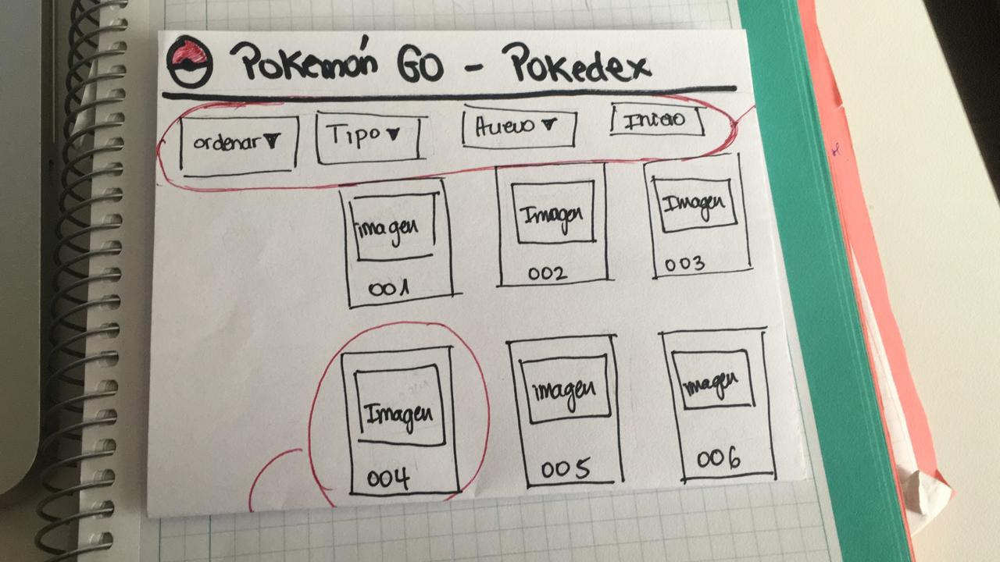
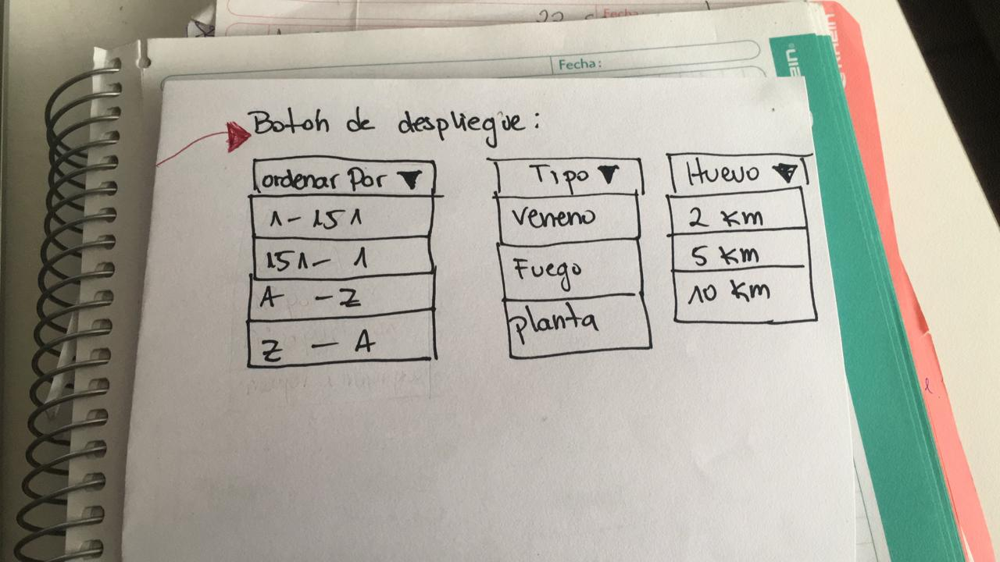
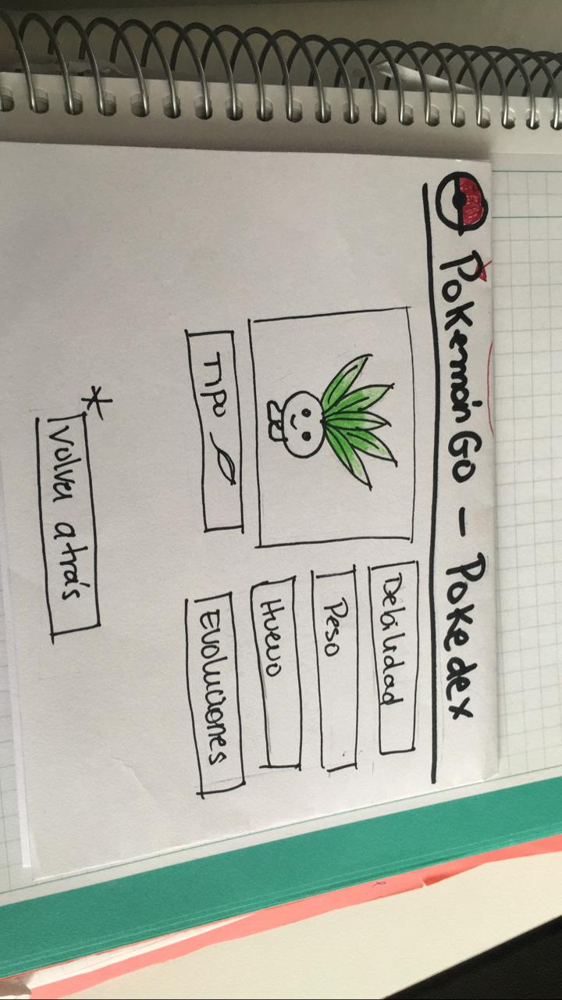
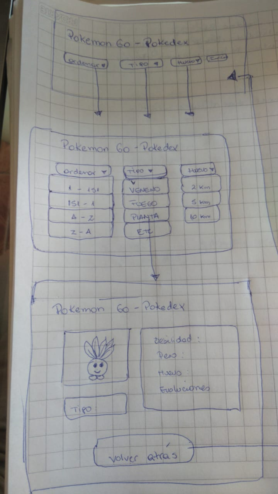
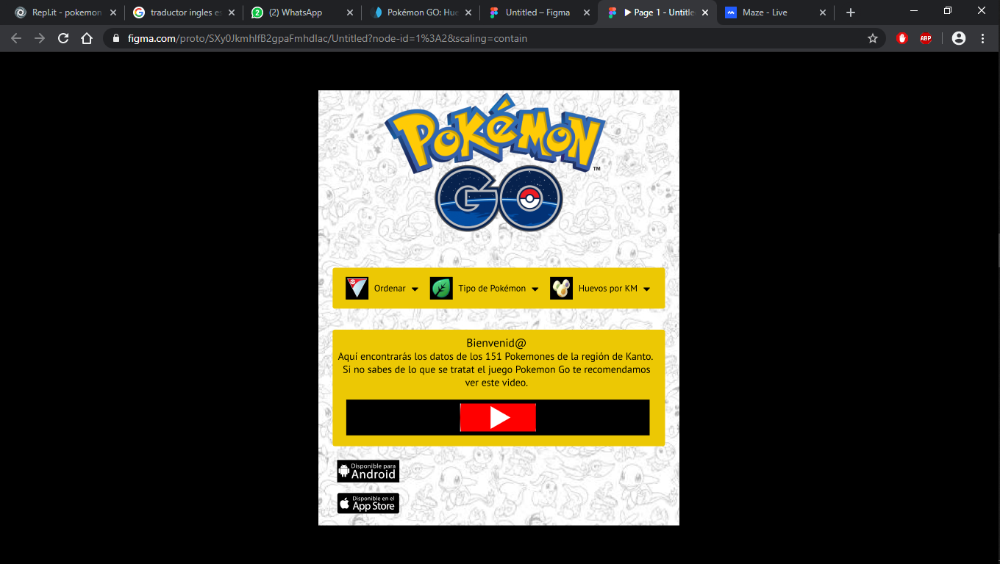

# Segundo proyecto Data Lovers

## Descripción General del proyecto

"Pokemon Go" es un videojuego de realidad aumentada desarrollado por Niantic, Inc. basado en la franquicia de videojuegos RPG Pokemon,donde debes buscar y capturar personajes de la saga "Pokémon" escondidos en ubicaciones del mundo real, luchar contra ellos, junto con desplazarte físicamente por las calles de tu ciudad para progresar.
"Pokemon GO - Pokedex", es una página web contenedora de todos los datos, características e información necesaria para usar los 151 primeros pokemones de la región de Kanto y así ser un experto maestro Pokemon. Puedes encontrar a los personajes mediante filtros como número de pokedex, órden alfabético, por tipo (agua, fuego, hielo, dragón, planta, veneno, etc) y por Km de eclosión de huevo. Es una web intuitiva de fácil manejo, ya que sin necesidad de seguir instrucciones el usuario puede acceder a toda la información que contiene.

***

## Definición de Usuario

Sexo: Hombres - Mujeres
Edad: Mayores de 14 años
Público objetivo y general: personas con o sin conocimiento sobre el videojuego que deseen obtener información sobre los personajes de la primera generación de la serie Pokemón.

## Historias de Usuario

Metodología

Se realizó una encuesta a personas conocidas que tenian alguna noción de Pokémon GO a través de whatsapp, donde se pidió algunos datos sobre su experiencia con el juego Pokémon GO y su opinión de aplicaciones similares a "Pokemon Go - Pokedex". 

Historia Usuaria uno
•	Usuario (Yo): Fernanda, jugadora novata de Pokémon Go.
•	Necesita (Qué, Quiero): Conocer los nombres y características de los pokémones, sin necesidad de haberlos atrapados.
•	Para: Poder saber cuáles son los mejores pokemones y aplicarlo para ganar batallas en los gimnasios Pokémon.

Historia Usuario dos
•	Usuario (Yo): Andrés, jugador de Pokémon Go.
•	Necesita (Qué, Quiero): Saber que pokemones puedo obtener de la eclosión de huevos.
•	Para: Poder saber que pokemones puedo obtener de los huevos y cuáles son los que me sirven.

Requerimientos
•	Mostrar los 151 pokemones  según orden alfabético y según Pokédex
•	Ver información detallada del Pokémon seleccionado.
•	Filtrar pokemones según su eclosión de huevo de acuerdo a KM.
•	Añadimos filtrado por tipo (Fuego, Agua, Tierra, Eléctrico, etc).

## Diseño de Interfaz de Usuario

### Prototipo de baja fidelidad

Foto prototipo a mano alzada
 
 
 
 

### Prototipo de alta Fidelidad

En este diseño de Interfaz de Usuario se utilizó Figma (https://www.figma.com/file/SXy0JkmhlfB2gpaFmhdIac/Untitled?node-id=0%3A1) como herramienta de diseño visual.

## Testeo de Usabilidad

### Primer testeo

En este testeo de Interfaz de Usuario se utilizó Maze (https://t.maze.design/10591369) como herramienta, y fue realizado a cinco posibles usuarios con el prototipo mínimo viable.

### Objetivos de testeo

1.	Probar la utilidad de la web de manera intuitiva.
2.	Probar si los filtros son los adecuados.

## Desarrollo de Interfaz

### Diagrama de Flujo

### Propuesta del Proyecto

### Testeo

